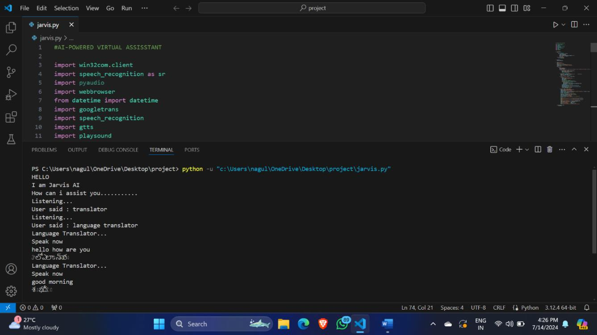
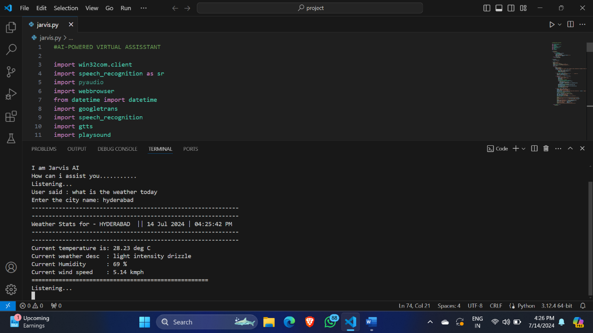

# Jarvis AI Virtual Assistant

## Description
Jarvis is an AI-powered virtual assistant implemented in Python. It uses speech recognition to understand voice commands and responds using text-to-speech. Jarvis can perform various tasks such as opening websites, telling the current time, translating languages, and providing weather updates.

## Features
- Voice command recognition using microphone input.
- Opens popular websites like YouTube, Wikipedia, and Google on command.
- Announces the current date and time.
- Language translator that converts spoken English to Telugu and plays the translated audio.
- Provides weather information for any city using the OpenWeatherMap API.

## Installation
To run Jarvis, you need to install the following Python libraries:

```bash
pip install pywin32 SpeechRecognition pyaudio googletrans==4.0.0-rc1 gtts playsound requests
```

Note: `pyaudio` installation may require additional system dependencies depending on your OS.

## Usage
1. Ensure your microphone is connected and working.
2. Run the script:

```bash
python jarvis.py
```

3. Jarvis will greet you and start listening for commands.
4. Speak commands such as:
   - "Open YouTube"
   - "What is the time?"
   - "Language translator"
   - "Weather"

## OpenWeatherMap API Key
The weather feature uses the OpenWeatherMap API. The API key is currently hardcoded in the script. You can replace the API key in the script with your own key if needed.

## Project Output (Screenshots)
*Note: Screenshots here are to showcase Jarvis AI in action, such as voice command recognition, website opening, language translation, and weather updates.*

   

   